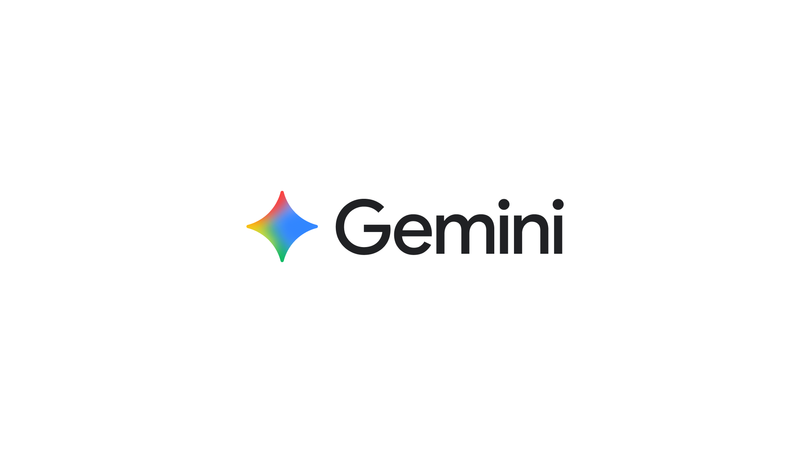
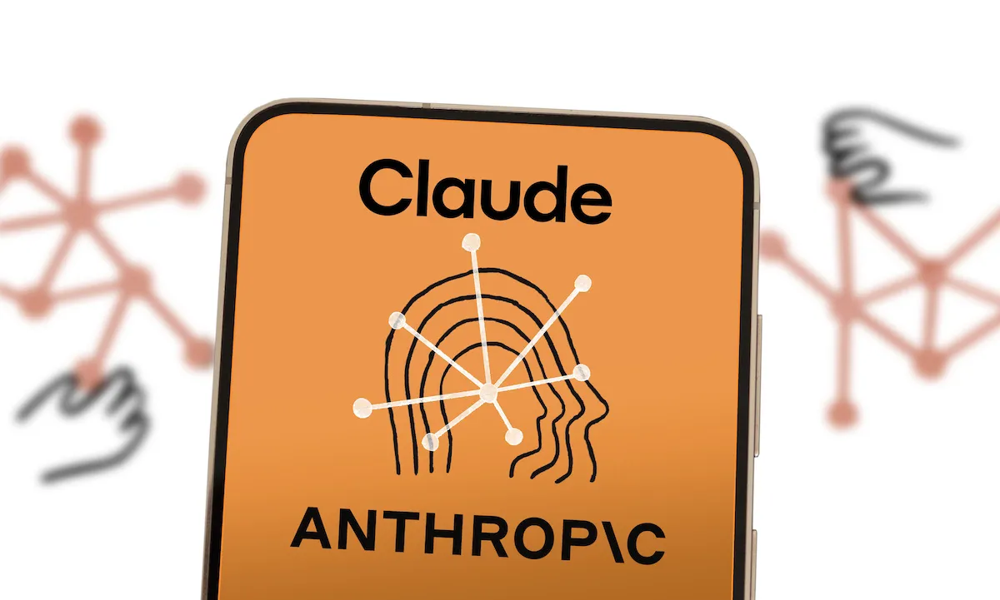

EE# Inteligencia Artificial
## Tecnologías actuales
1. ChatGPT — OpenAI
    -Su uso principal es: Se utiliza para programación, generación de texto, análisis, investigación y automatización.
    - DocuWare utiliza ChatGPT para analizar, resumir y extraer información de documentos de forma rápida y automática.

[Visita DocuWare](https://stackshare.io/companies/docuware)

2. Google Gemini — Google
    -Su uso principal es: se utiliza para escritura, análisis, programación y tareas multimodales. 
    - Purple Technology utiliza Google Gemini para apoyar tareas de inteligencia artificial, como programación, análisis de información y desarrollo de proyectos tecnológicos.

[Visita Purple Technology](https://stackshare.io/companies/purple-technology)
     

3. Hugging Face
    - Su uso principal:Para desarrollar, entrenar y utilizar modelos de Inteligencia Artificial y aprendizaje automático tambien permite trabajar con modelos de lenguaje, procesamiento de texto, imágenes y otras aplicaciones de IA. 
    - Crunch utiliza Hugging Face para desarrollar y utilizar modelos de inteligencia artificial en sus proyectos tecnológicos.

[Visita Crunch](https://stackshare.io/companies/crunch)
     

4. Mistral 7B
    -Su uso principal:Como modelo de inteligencia artificial para procesamiento y generación de lenguaje, por ejemplo, para comprender y generar texto como desarrollar aplicaciones basadas en IA.
    - Exagon utiliza Mistral 7B para desarrollar soluciones de inteligencia artificial y procesamiento de información.

[Visita exagon](https://stackshare.io/exagon/exagons-tech-stack)
     

5. Claude — Anthropic
    -Su uso principal es :para programación, análisis de documentos, razonamiento y trabajo profesional, alrededor del 2.57 % de cuota mundial.
    - Purple Technology utiliza Claude para apoyar el desarrollo de software, analizar información y realizar tareas con inteligencia artificial.

[Visita Purple Technology](https://stackshare.io/companies/purple-technology)
     
